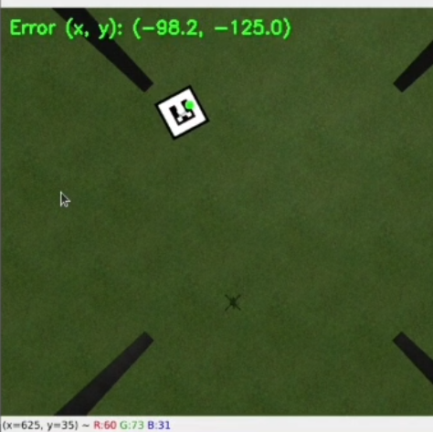

# Vision-based Autonomous Quadcopter Landing

This project demonstrates a vision-based autonomous landing system for quadcopters, using the PX4 Autopilot simulator. The system integrates computer vision and control algorithms to ensure precise landing under varied environmental conditions.


## Setup and Installation

Follow the instructions present in ```Installation.md``` to setup the repository

## Deployment

The system has four launch files embedded in mavros_off_board and these are used to launch the vehicle, the functionality of each launcher is:

```posix_sitl.launch```:  It launches PX4 SITL in Gazebo

```mavros_posix_sitl.launch```: This launch file launches Mavros, PX4 SITL and Gazebo. This launch file allows the control of the vehicle with ROS. The model launched is in sdf format.

```mavros_rviz.launch```: This launch file is only for visualization purpose and shows the vehicle in Gazebo and Rviz. The model launched is in urdf format.

```urdf_launcher.launch```: This launch file launches Mavros, PX4 SITL, Rviz and Gazebo. This launch file allows the control of the vehicle with ROS. The model launched is in xacro format.

Use the launch files based on your own needs. If you need only simulate the vehicle use ```mavros_posix_sitl.launch```, but if visualization in Rviz is also needed use ```urdf_launcher.launch```.


With the package mavros_off_board launch the system in a simulated environment
```
cd PX4-Autopilot  
DONT_RUN=1 make px4_sitl_default gazebo
source ~/catkin_ws/devel/setup.bash
source Tools/setup_gazebo.bash $(pwd) $(pwd)/build/px4_sitl_default
export ROS_PACKAGE_PATH=$ROS_PACKAGE_PATH:$(pwd)
export ROS_PACKAGE_PATH=$ROS_PACKAGE_PATH:$(pwd)/Tools/sitl_gazebo
roslaunch mavros_off_board mavros_posix_sitl.launch
```

To use the Yolov8 based detection pipeline in object_detector use
```
python3 object_detector/scripts/perception.py 
```
This will start the detection module of the system and track the landing platform as shown by the image below.


And calculate error as shown by the image below



To autonomously land the vehicle use the drone_controller package. The process variable of the controller is the output of the detection pipeline. Do not use this package without the detector.
```
python3 drone_controller/scripts/PID_Controller.py  
```
The variables controlled are velocity in X and Y, the yaw rate and the position in Z of the quad-rotor.

## Acknowledgments

We thank the authors of the ```https://github.com/MikeS96/autonomous_landing_uav``` for providing the simulation environment used in this project.


## Citation


```
@article{9656574,
	title        = {Monocular Visual Autonomous Landing System for Quadcopter Drones Using Software in the Loop},
	author       = {Saavedra-Ruiz, Miguel and Pinto-Vargas, Ana Maria and Romero-Cano, Victor},
	year         = 2022,
	journal      = {IEEE Aerospace and Electronic Systems Magazine},
	volume       = 37,
	number       = 5,
	pages        = {2--16},
	doi          = {10.1109/MAES.2021.3115208}
}
```
